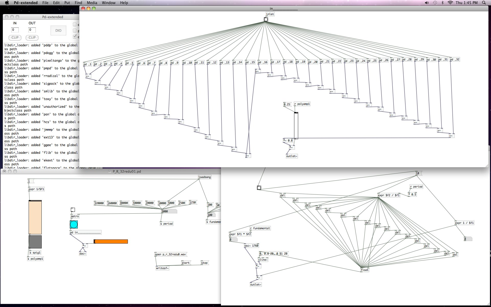

# Greetings
I've been very interested in getting back into writing algorithmic electronic music from scratch. It's what I spent a great deal of time on in undergrad,
using software like [MaxMSP](https://cycling74.com/products/max/) and [PureData](https://puredata.info/). Here's a piece from my 'senior project' called [Crystal Growth](https://soundcloud.com/nickgideo/crystal-growth).  

When I started using MaxMSP and PD, I barely knew anything about programming. For instance, Crystal Growth could have easily been constructed using loops, but because I didn't even know what loops *were*, I basically hard-wired everything. 
If you look at the lower right corner of the image below you'll see a daisy-chain of delays. Each delay corresponds to a 
single triggering of a note played by an oscillator (an object that makes sound). Clearly, this was not a scaleable 
way to make music!




After graduating, I stumbled into a job where I needed to learn how to organize things in spreadsheets,
and automate some of the process. Google Apps (docs, sheets, etc) has a neat feature that lets you write 
[scripts](https://developers.google.com/apps-script/) using JavaScript, so I started teaching myself 
a *real* programming language (if you can call it that). 
I quickly realized how idiotic I was to not have used loops in my previous programming efforts (among other things)! 

Another huge advancement was the power of being able to *write* instructions. In MaxMSP and PureData, you 'write code' by 
clicking and dragging 'wires' that connect object blocks. This is *INCREDIBLY* tedious for a large program (see above) so I 
hoped that someday I could find a way to write algorithmic electronic music using a text based programming language and not 
with a damn mouse! 

At about the time I started learning JavaScript, I discovered [SuperCollider](https://supercollider.github.io/). I was still 
too green to understand its wacky syntax (more on this later) and didn't know enough about basic programming and comp-sci 
fundamentals to really grok how to use it.
Fast forward a few years to today, where I feel ready to start exploring and writing about the journey<sup id="a1">[1](#f1)</sup>.

# First Impressions

As I said before, my first *real* (and very serious) language was [JavaScript](https://www.destroyallsoftware.com/talks/wat). 
Despite its own weirdness, its syntax and semeantics feels like *home*, so it's what I compare to when I learn a new language. 
Lisp was hard because it felt like everything was upside down and inside out. 
C++ was full of pointer pitfalls. Python was like writing prose. Every new language one learns has its awkward learning 
moments, so just like the rest, learning SuperCollider has felt like.. *"Wat?"*. 

## Scope and Nope, Functions and Funtime!

Awesome, so I'm looking at this language now and it looks neat. A little *wierd*, but neat. I boot up the audio-server with 
CTRL-B and try to remember how to make a sound. I think I know how it works so lets see. 
The IDE has nice code-execution -- hitting SHIFT-ENTER will execute a line -- so I hit that as I go. 
Lets make an oscillator and try to make a sound.
``` SuperCollider
x = SinOsc.ar
x.play
```
Output:
``` console
-> a SinOsc
ERROR: Message 'play' not understood.
...
```
Oh, crap. *Right!* I forgot that you need to put curley brackets around the synth like so:
``` SuperCollider
x = {SinOsc.ar}
x.play
```
``` console
-> a Function
-> Synth('temp__1' : 1000)
```
Sweet! This creates a sine-wave generator (the part that says `-> Synth('temp__1' : 1000)` in the post window) at the default 440hz. 
Hitting CTRL-. (ie the Control key and a `.`) kills the sound. 
So what's the deal with the curleys that I needed? As you can see above, 
wrapping statements in curleys turns it into a function (as noted in the post window when it printed 
```
-> a Function
``` 
after I evaluated
that line). Since synths don't have a `play` method, but functions do, we need to wrap code up in curleys to make sure we can execute it
as a sound generator. Ok, sure. Thats fine. 

The code above can be cleaned up a bit too, as you can call methods directly on function literals <sup id="a2">[2](#f2)</sup>.
``` SuperCollider
y = {SinOsc.ar}.play;
```
Nice. 

Ok, so let's flesh out this sine wave and try to make it more musical. When we write `SineOsc.ar`, we're creating a synth that is 
generating an audio signal (the `ar` bit means 'audio-rate', which generates enough wave-form samples to sound good when played on
our speakers). We can pass in some arguments to change the default settings like so<sup id="a3">[3](#f3)</sup>:
``` SuperCollider
y = {SinOsc.ar(freq:220, phase:0, mul:0.25, add:0)}.play;
```
Cool. Since I'm in the habit of writing functions that handle little bits of computation, I'd like to write a little function that 
randomly selects a frequency multiplyer for our little sine wave. Here's my first attempt (spoiler alert: this is *incorrect* as we'll see 
shortly). After writing this, I hit CTRL-A to highlight everything and evaluate with CTRL-ENTER:
``` SuperCollider
randHarmonic = {
  var primes = [2,3,5,7,11,13];
  primes[ 6.rand ]; // value of last line of a function is returned implicitly
};

y = {SinOsc.ar( 220 * randHarmonic, mul:0.25)}.play;
```
Uh oh.. I got an error:
``` Error
ERROR: Variable 'randHarmonic' not defined.
  in file 'selected text'
  line 4 char 2:

  };
   
-----------------------------------
ERROR: Variable 'randHarmonic' not defined.
  in file 'selected text'
  line 6 char 34:

  y = {SinOsc.ar( 220 * randHarmonic, mul:0.25)}.play; 
                                    
-----------------------------------
-> nil
```
But I defined `randHarmonic` the same way as the function `y`, didn't I? How come it didn't work? Well dear reader, you'd be surprised to find out 
that SuperCollider treats lower-case single-letter variable names like `y` differently than longer names like `randHarmonic`. Awesome 🙃. It all has to do with local and global variables. Lower case letters are reserved as global variables, and therefore when we
assign a function to one of these letters it is visible everywhere. My `randHarmonic` name isn't visible anywhere, in fact (because I didn't use `var`, I think..), so to make
it into a global variable I have to prepend a `~` before the name. 


Also, to make things easier for evaluation, we need to surround all 
of these statements in `()` paren's to tell the interpreter to treat everything as a single code block. This is handy because now we can
evaluate the whole block with CTRL-ENTER without having to highlight every line (as long as the cursor is focused anywhere within the
block). So now our code looks like this:
``` SuperCollider
(
~randHarmonic = {
  var primes = [2,3,5,7,11,13];
  primes[ 6.rand ]; // value of last line of a function is returned implicitly
};

y = {SinOsc.ar( 220 * ~randHarmonic, mul:0.25)}.play;
)
```
Evaluating this block creates a new synth with a frequency that is multiplied by a randomly selected prime number. If you keep 
evaluating it then it will keep creating new syths that are all in harmony with eachother (though they may sound a bit funny!). 

### More coming soon...

# Notes

<b id="f1">1:</b> I'm assuming the reader has some familiarity with programming languages, whether its JavaScript or Python or Java. 
I'll be using a lot of analogies from other languages, but I'll try to explain things as I go. 
Please comment if you'd like clarification or point out an error, though please realize that this document is intented as a record 
of my *mistakes* as I've been learning the SuperCollider language. [↩](#a1)

---

<b id="f2">2:</b> A function literal is a group of
statements surrounded in `{}` (curley brackets). The term *literal* means that you don't need to add a redundent statement declaring
that you intend to create a function, like how most everything is in Java. You're probably most familiar with string literals that 
surround the content in `""` quotes like so: `"I am a string"`. JavaScript has Array literals where you can just write 
``` JavaScript
x = ["I", "am", "a", "string", "array"]
```
And *almost* has function literals with the addition of arrow functions
``` JavaScript
add = (arg1, arg2) => arg1 + arg2 
x = add(1, 2) // evaluates to: x = 1 + 2
```
but the syntax isn't the same as in SuperCollider. [↩](#a2)

---

<b id="f3">3:</b> We don't need to specify the argument names, but I wrote it here to document what the arguments mean. It 
could have looked like so:
``` SuperCollider
y = {SinOsc.ar(220, 0, 0.25, 0)}.play;
// or
y = {SinOsc.ar(220, 0, 0.25)}.play;
// or
y = {SinOsc.ar(freq:220, mul:0.25)}.play;
// etc..
```
[↩](#a3)


